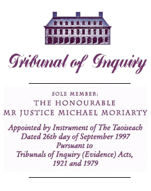

You can [view the site here](http://irisholigarch.github.io/)

On August 5th 2015, [Waterford Whispers News](http://waterfordwhispersnews.com/) posted a very funny satirical piece about Irish billionaire [Denis O'Brien](http://www.moriarty-tribunal.ie/asp/index.asp?ObjectID=636&Mode=0&RecordID=399). His lawyers sent a [Cease and Desist letter](https://twitter.com/ColmWhispers/status/629345366585016321/photo/1) to them and they removed the piece. The contents of the original article are in this GitHub repo. You should fork this repo and publish your own copy. Denis is currently learning the meaning of the phrase ["The Streisand Effect"](https://en.wikipedia.org/wiki/Streisand_effect). #JeSuisWWN

## How do you create a copy of this site?
It's really easy and you don't have to install or download anything.

1. Create an account here on GitHub (let's assume you pick the username "YourUserName")
2. Come back to https://github.com/IrishOligarch/irisholigarch.github.io
3. In the top right of the page, you can see a Fork button. Click it.
4. You now have a copy of the source at https://github.com/YourUserName/irisholigarch.github.io
5. Go there and click the Settings link on the right hand side of the page
6. Change the Repository name from irisholigarch.github.io to YourUserName.github.io and click the rename button
7. Now go to https://github.com/YourUserName/YourUserName.github.io
8. Click on the README.md file
9. Click the Pencil icon to edit the file
10. On the first line, change http://irisholigarch.github.io/ to http://YourUserName.github.io/
11. Click the green "Commit Changes" button
12. That's it! Your copy of the site is now visible to the world at http://YourUserName.github.io/

